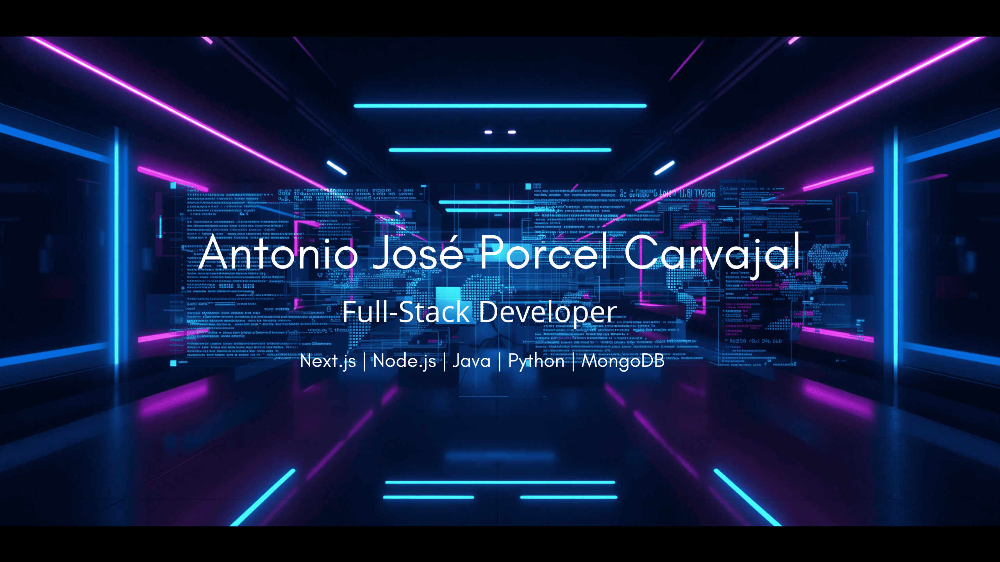

# Hey, I'm Antonio José 👋
### Junior Full-Stack Developer · Building real-world apps

---

## 🧑‍💻 About me

Junior Full-Stack Developer focused on building scalable and functional web applications. I work with modern technologies to create products that solve real problems — from backend architecture to polished frontend interfaces. Currently developing a **Portfolio Full-Stack** project while continuously expanding my skills in distributed systems and cloud deployment.

💡 I believe in clean code, continuous iteration, and shipping things that actually work.

---

## 🛠 Tech Stack

---

## 📊 GitHub Stats

  
  

  

---

## 🚀 Featured Projects

### 📁 [Portfolio Full-Stack](https://github.com/aporcar25/mi-proyecto-nextjs)
Personal portfolio built with Next.js, deployed end-to-end. Includes contact form with MongoDB backend, responsive design and dynamic project showcase.  
`Next.js` · `MongoDB` · `Node.js` · `Tailwind CSS`

---

## 📬 Contact

